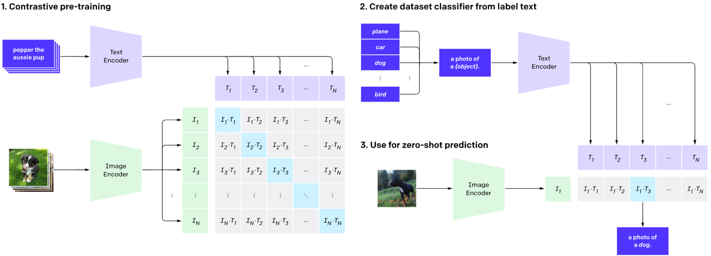
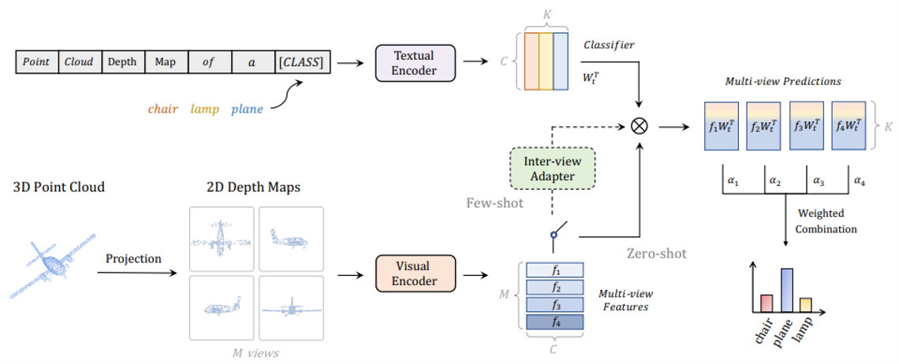
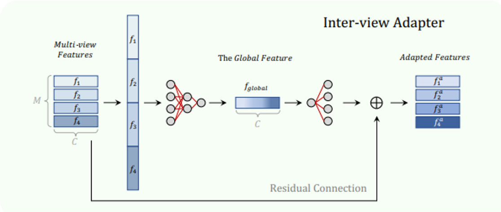
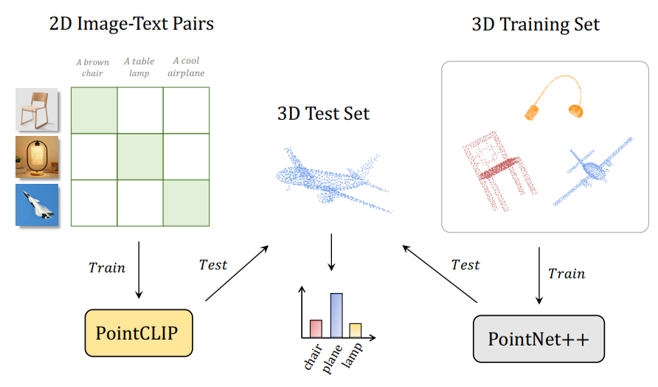
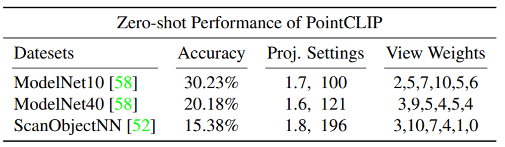
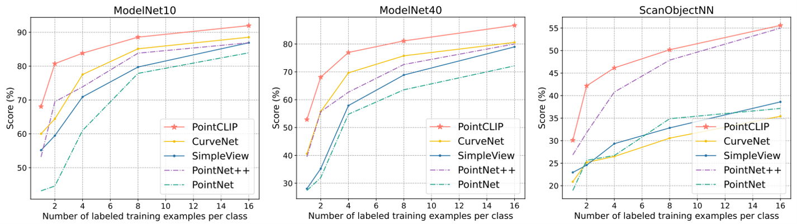
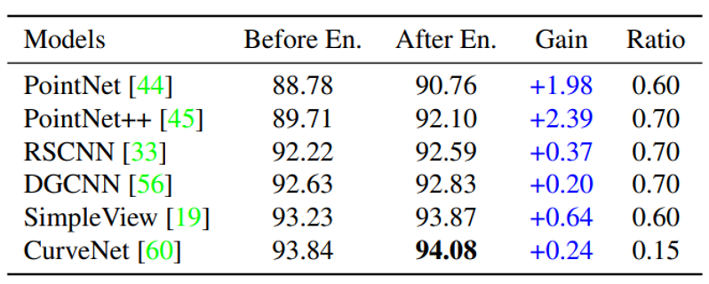

<h1>Paper analysis on zero-shot classification of 3D point cloud</h1>

In this blog post, I will review the paper PointCLIP: Point Cloud Understanding by CLIP published in CVPR 2022[1]. After briefly introducing the topic, I will explain the method in deteil. Then we will discuss the future works and my opinion on the paper.

<h2>Introduction</h2>

Deep learning has undoubtedly revolutionized various computer vision tasks across both 2D and 3D domains, tackling problems such as image classification, object detection, semantic segmentation, and point cloud recognition. However, the evolving world of 3D technology, particularly with the advent of sophisticated 3D sensing, is continually pushing the boundaries of what deep learning models can achieve. 

One specific challenge in the 3D world is dealing with point clouds - sets of data points in space that represent objects. Unlike 2D image data, 3D point clouds often suffer from space sparsity and irregular distribution, making it challenging to directly apply methods from the 2D realm. Even more interestingly, many newly captured point clouds contain objects from "unseen" categories, i.e., objects the model hasn't been trained on. This opens up a real challenge since even the best classifier might fail to recognize these objects, and re-training models each time when these "unseen" objects arise can be quite impractical.

In contrast, 2D vision tasks have made significant progress in mitigating similar issues, particularly through the use of Contrastive Vision-Language Pre-training (CLIP). By correlating vision and language, CLIP has shown promising results for zero-shot classification of "unseen" categories. Further enhancements have been achieved through the use of learnable tokens (CoOp), lightweight residual-style adapters (CLIP-Adapter), and efficiency improvements (Tip-Adapter). 

This naturally leads us to a question: can such promising methods be successfully transferred to the more challenging domain of 3D point clouds? In this blog post, we introduce PointCLIP, a novel model that addresses this question by transferring CLIP's 2D pre-trained knowledge to 3D point cloud understanding. 

<h2>Method</h2>

### Terminology

- Zero-shot classification: the model recognize a certain class, without having been trained on any sample of this class before.
- Few-shot classification: the model recognize a certain class, with having been trained on only a few samples of this class before.

As I said in the Introduction, PointCLIP tries to transfer the pretrained knowledge in 2D image in CLIP to the recognition of 3D point clouds, so it is necessary to introduce the main principles of CLIP here.
### A revisit to CLIP

CLIP (Contrastive Language–Image Pretraining) is a multimodal vision-language model developed by OpenAI. Its goal is to understand the relationship between images and text, which is achieved by representing images and text in the same embedding space. In this space, associated images and texts are mapped closer together. Now, let me explain how it works by dividing its pipeline into three parts and explaining each part one by one.

    

- Contrastive Pre-Training: CLIP is trained with a contrastive learning approach. This technique pushes the model to identify which data are similar and which are different. CLIP is trained to bring related images and text closer while distancing unrelated images and text in the embedding space.
- Creating a Dataset Classifier from Label Text: After CLIP is pre-trained, we get the optimized text- and image encoders, then it can be used for downstream tasks, such as image classification, without task-specific fine-tuning. All possible classes the object on the input image may belong to are converted into textual prompts, and we input these textual prompts to the text-encoder, then we get the vectors of these textual prompts in the embedding space.
- Use for Zero-Shot Prediction: We input unseen image to the image-encoder, then we get the vector of this image in the embedding space, after that we multiply this vector with the vectors of those textual prompts one by one, the biggest one among these multiplications implicates the class the unseen image belongs to.

Now, we can finally introduce our protagonist, PointCLIP. The proposed PointCLIP is designed to address the disparity between the scale and diversity of 2D and 3D datasets, aiming to improve the understanding of 3D point cloud data. The primary idea behind PointCLIP is to leverage the pre-trained knowledge from the CLIP model, using it to carry out zero-shot learning on point clouds.

To facilitate this, point clouds are converted into representations that are compatible with CLIP by generating point-projected images from multiple views. This step bridges the modal gap between 2D and 3D data, making the point clouds easier for the model to process. Importantly, this is a cost-effective approach that doesn't require pre-transformation of the data, further enhancing its practical value.

### Main contributions

Let's have a look at the main contributions of the paper:

- Proposes PointCLIP to extend CLIP for handling 3D cloud data.
- An inter-view adapter is introduced upon PointCLIP and largely improves the performance by few-shot fine-tuning.
- PointCLIP can be utilized as a multi-knowledge ensemble module to enhance the performance of existing fully-trained 3D networks.

After listing the main contributions of the paper, let me explain how the paper realized zero-shot classification, few-shot classification and multi-knowledge ensembel, which conresponding to the first, second and last of the main contributions listed above, respectively.

### Zero-shot Classification

In the zero-shot classification setting, the authors extract visual features from the projected images of different views using CLIP. For the textual branch, K category names are encoded as textual features within a predefined template. These features serve as a zero-shot classifier. 

    

Classification logits for each view are calculated separately, and the final logits for the point cloud are obtained by performing a weighted summation of these individual logits. Each view's features encode a different perspective of the point cloud and are capable of independent zero-shot classification. Their aggregation further supplements the information from various perspectives to achieve a comprehensive understanding.

### Few-shot Classification

Considering scenarios where only a few instances of each unseen category are available, the authors propose an inter-view adapter, a three-layer Multi-layer Perceptron (MLP) added to PointCLIP to enhance its performance in few-shot settings. During training, the visual and textual encoders of CLIP are frozen, and only the inter-view adapter is fine-tuned via cross-entropy loss.

    

M-view features of a point cloud are concatenated along the channel dimension, and a compact global representation is obtained via two linear layers of the inter-view adapter. Features from multiple perspectives are fused into a summarizing vector, which is then used to generate a view-wise adapted feature via a residual connection. The further calculation is the same as the calculation in zero-shot classification explained above.

### Multi-knowledge Ensemble

Finally, the authors suggest the integration of PointCLIP with classical 3D networks. In practice, two models, PointNet++ and PointCLIP under 16-shot fine-tuning, are selected, and their predicted logits are simply added together to produce the final output. This ensemble approach enables the effective amalgamation of knowledge from both models, leading to improved joint inference. 

    

In essence, PointCLIP offers a method for transferring 2D pre-trained knowledge to 3D point clouds, coupled with an ensemble strategy for enhancing results. Particularly in scenarios where it's not feasible to train an entire model using large-scale fully annotated data, fine-tuning the three-layer adapter of PointCLIP with few-shot data can yield competitive performance.

<h2>Experimental results</h2>

### Zero-shot Classification Settings

PointCLIP was evaluated in a zero-shot classification setting on three popular datasets: ModelNet10, ModelNet40, and ScanObjectNN. The aim was to see how well PointCLIP could perform without any training data specific to these datasets. The pre-trained CLIP model used in this experiment employed ResNet-50 as the visual encoder and a transformer as the textual encoder.
Point clouds from six orthogonal views (front, right, back, left, top, and bottom) were projected with each view having a relative weight value between 1 and 10. Point coordinates were normalized from -1 to 1 and image planes were set at a fixed distance away from the coordinate center. The projection settings influenced the point distribution on the image and the size of the projected object.

    

PointCLIP performed surprisingly well without any 3D training, achieving 30.23% accuracy on the ModelNet10 dataset, a notable success in transferring knowledge from 2D to 3D. For ModelNet40 and ScanObjectNN, the performance was slightly worse, at 20.18% and 15.38% respectively, likely due to the lack of 3D-specific adaptations.

### Few-shot Classification Settings

PointCLIP was further tested in a few-shot classification setting with varying amounts of shots (1, 2, 4, 8, 16) on the same datasets. The number of shots refers to the number of point clouds randomly sampled from each category in the training set. In this setting, the researchers used a stronger visual encoder (ResNet-101) for better feature extraction and increased the number of projected views to 10.

    

PointCLIP demonstrated distinct advantages when there were only a small number of samples per category, surpassing PointNet by 25.49% and CurveNet by 12.29% on ModelNet40 with just one shot. Even with more training samples, PointCLIP continued to lead in performance.

### Multi-knowledge Ensemble Settings

In the third experimental setup, PointCLIP was compared with traditional 3D networks - PointNet, PointNet++, DGCNN, SimpleView, and CurveNet - to verify the effectiveness of blending pretrained 2D knowledge with 3D knowledge. The researchers found that ensemble models that included PointCLIP performed better than the 3D networks alone.

    

Even though PointCLIP's accuracy was lower than the fully trained 3D models, it improved their performance when combined in an ensemble. The best performance was achieved by combining PointCLIP with the state-of-the-art CurveNet, achieving an accuracy of 94.08%. This experiment shows the complementary nature of PointCLIP to existing 3D models. The knowledge transferred from 2D to 3D via PointCLIP provides additional valuable information to traditional 3D learning methods.

<h2>Discussion</h2>

As future work, authors suggest generalizing CLIP for wider 3D applications.
I think PointCLIP is an innovative approach to 3D point cloud classification, and this paper has several **strong points**:

- **Knowledge Transfer**: The authors demonstrate that PointCLIP effectively transfers knowledge from 2D to 3D, leveraging a pre-trained CLIP model to deal with 3D point clouds, which is quite innovative.

- **Zero-shot and Few-shot Learning**: The paper shows promising results in zero-shot and few-shot learning settings, demonstrating the robustness and flexibility of PointCLIP.

- **Detailed Experiments and Ablation Studies**: The authors conducted extensive experiments and ablation studies, providing a comprehensive understanding of how PointCLIP works and its performance under different settings. 

However, there are also some **potential limitations**:

- **Limited 3D Understanding**: While PointCLIP shows the capability to understand 3D data to a certain extent, its performance falls off in more complex scenarios. The paper admits that PointCLIP’s performance suffers when applied to noisy real-world scenes or datasets with more categories, indicating that it may lack the necessary sophistication for truly understanding 3D data.

- **Dependency on Pre-trained Models**: PointCLIP's performance largely relies on the pre-trained CLIP model. How well it can generalize to other datasets or tasks is dependent on the quality of the pre-training.

- **Computational Costs**: The use of multiple views and multiple prompt designs might increase computational costs. Depending on the hardware and software setup, this may limit the application of the approach.

- **Lack of Comparative Analysis**: While the paper includes some comparisons with state-of-the-art models, a more thorough comparative analysis with other 3D point cloud classification methods would strengthen the results.

In conclusion, while PointCLIP presents an intriguing new way to approach 3D point cloud classification, further research and development are required to fully realize its potential.
